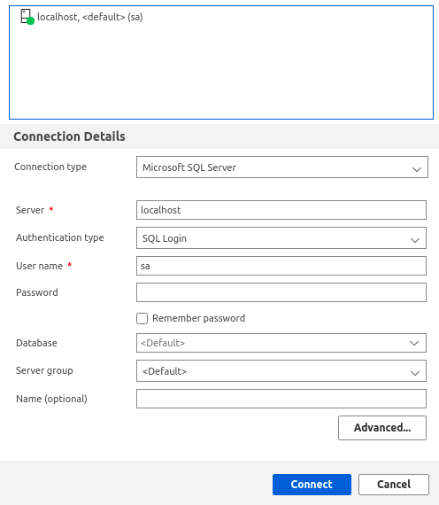

# sql-server-balta
Curso de sql server do balta.io

A primeira etapa do curso é instalação de um container com o sql server. Este processo pode ser feito por meio das instruções apresentadas no artigo de [sql-server](https://balta.io/blog/sql-server-docker) do site balta.io.

Em resumo o que deve ser feito é o download da imagem do **sql server** e em segunda rodar e configurar o container.
Para instalar o sql-server

```bash
docker pull mcr.microsoft.com/mssql/server
```
Para configura o container,

```bash
docker run --name sqlserver -e "ACCEPT_EULA=Y" -e "MSSQL_SA_PASSWORD=1q2w3e4r@#$" -p 1433:1433 -d mcr.microsoft.com/mssql/server
```
Caso queira mudar a senha de acessa ao servidor basta redefinir `MSSQL_SA_PASSWORD` para a senha desejada.

Vale ressaltar que as as configurações são realizadas por configuração de variáveis de ambiente por meio da opção -e. Já a opção -p define a configuração de roteamento das portas.

A string de conexão fica como a seguinte

```
Server=localhost,1433;Database=balta;User ID=sa;Password=1q2w3e4r@#$;Trusted_Connection=False; TrustServerCertificate=True;
```

## Instalação da GUI

Para acessar o servidor por meio de interface gráfica pode-se instalar o [Azure Data Studio](https://docs.microsoft.com/en-us/sql/azure-data-studio/download-azure-data-studio?view=sql-server-ver15).

